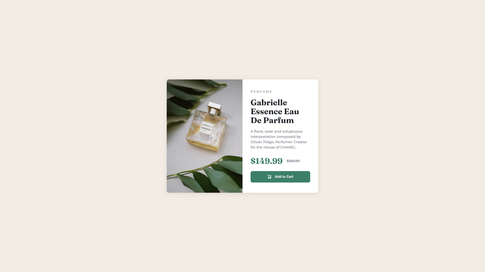

# Frontend Mentor - Product preview card component solution

This is a solution to the [Product preview card component challenge on Frontend Mentor](https://www.frontendmentor.io/challenges/product-preview-card-component-GO7UmttRfa). Frontend Mentor challenges help you improve your coding skills by building realistic projects.

## Table of contents

- [Overview](#overview)
  - [The challenge](#the-challenge)
  - [Screenshot](#screenshot)
  - [Links](#links)
- [My process](#my-process)
  - [Built with](#built-with)
  - [What I learned](#what-i-learned)
  - [Continued development](#continued-development)
  - [Useful resources](#useful-resources)
- [Author](#author)

## Overview

### The challenge

Users should be able to:

- View the optimal layout depending on their device's screen size
- See hover and focus states for interactive elements

### Screenshot

### Links

- Repository URL: [GitHub](https://github.com/moadavou/product-preview-card-component)
- Live Site URL: [GitHub Pages](https://moadavou.github.io/product-preview-card-component/)

## My process

### Built with

- Semantic HTML5 markup
- CSS custom properties
- CUBE CSS
- Flexbox
- CSS Grid
- Mobile-first workflow

### What I learned

For this project, I continued working with **utility classes** and began learning about the **CUBE CSS methodology**. It's still very new to me, so keep your expectations low.

**I also learned...**

- ... that `margin-inline` & `margin-block` (or padding) is a thing. I'm never going back to just margin!

- ... about the **visually-hidden** class. I still don't fully understand all of the attributes though.

- ... a little more about how to write accessible code.

### Continued development

I want to continue to develop and learn about the **CUBE CSS methodology** and understand how I can make my websites **as accessible as possible**.

### Useful resources

- [How to plan your HTML (1): Product Preview Card](https://fedmentor.dev/posts/html-plan-product-preview/) - This article goes through the steps to complete this challenge with accessibility in mind.

## Author

- Frontend Mentor - [@moadavou](https://www.frontendmentor.io/profile/moadavou)
- GitHub - [@moadavou](https://github.com/moadavou)
